# Installation
### 1. Install python
> https://realpython.com/installing-python/
### 2. Clone this repo into your local machine 
> git clone https://github.com/tabbott207/CircleEvents
### 3. Install VirtualEnv
>pip install virtualenv
>
>python -m venv env
>
>On macOS and Linux:
>source env/bin/activate
>
>On Windows:
>.\env\Scripts\activate
>
### 3. Install django
> pip install django
### 4. Install required dependencies
> pip install -r requirements.txt
### 5. Final Step
> go to the directory where manage.py is located and run the following command
>
>> python manage.py runserver
# Screenshots
### v0.0
### HomePage when the User is logged in
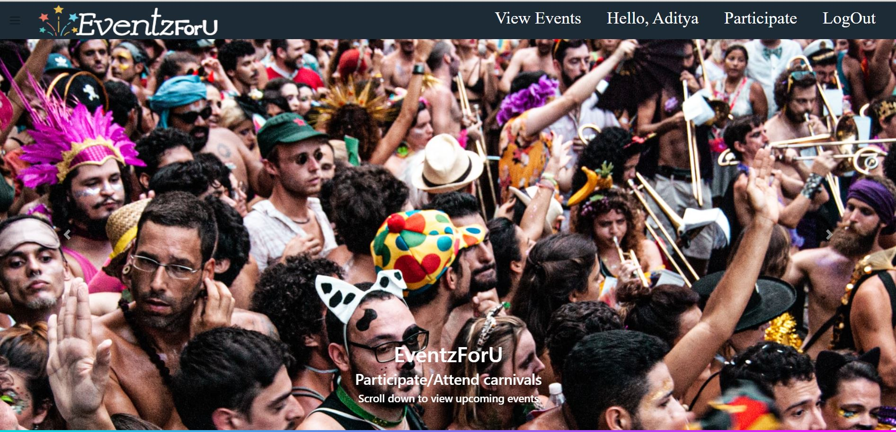
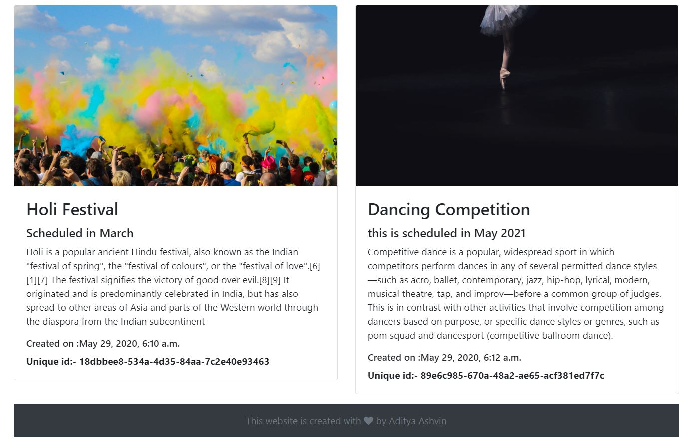
### HomePage when the User is not logged in
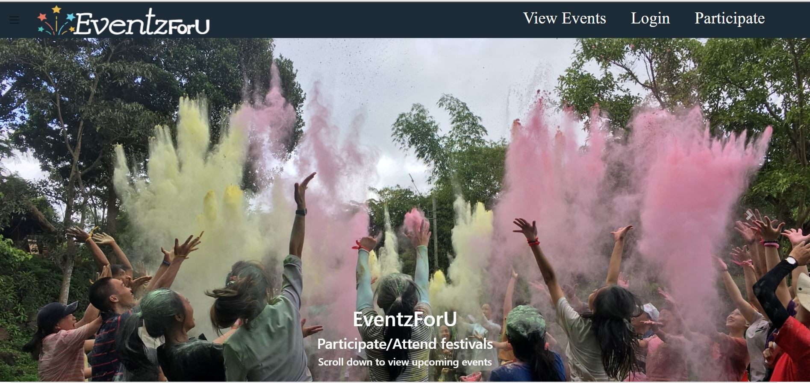
### Participant Page when the user is logged in
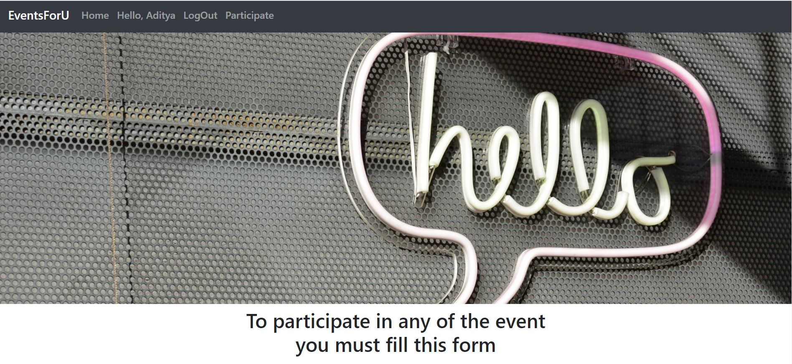
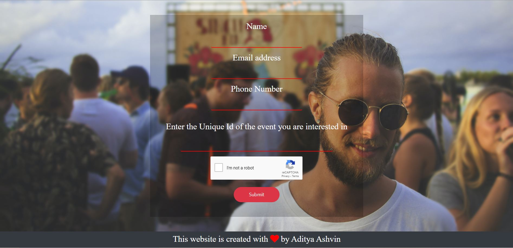
### ParticipantPage when the User is not logged in
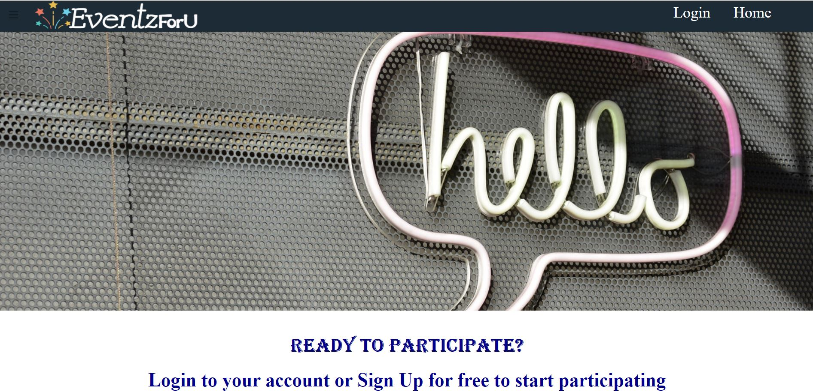
### v0.1
### HomePage when the User is logged in
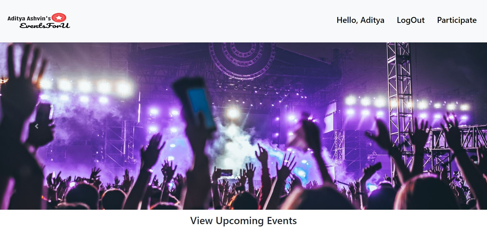
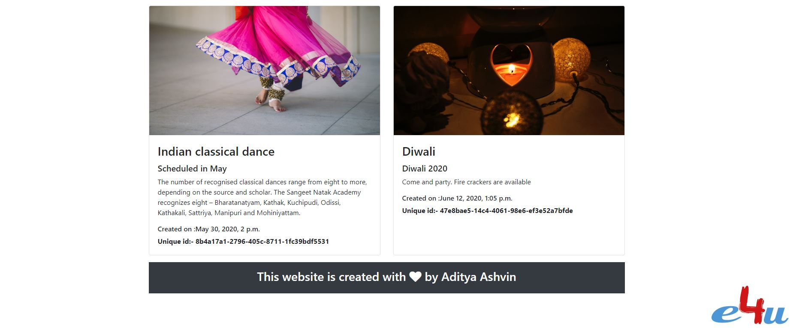
### Login Page
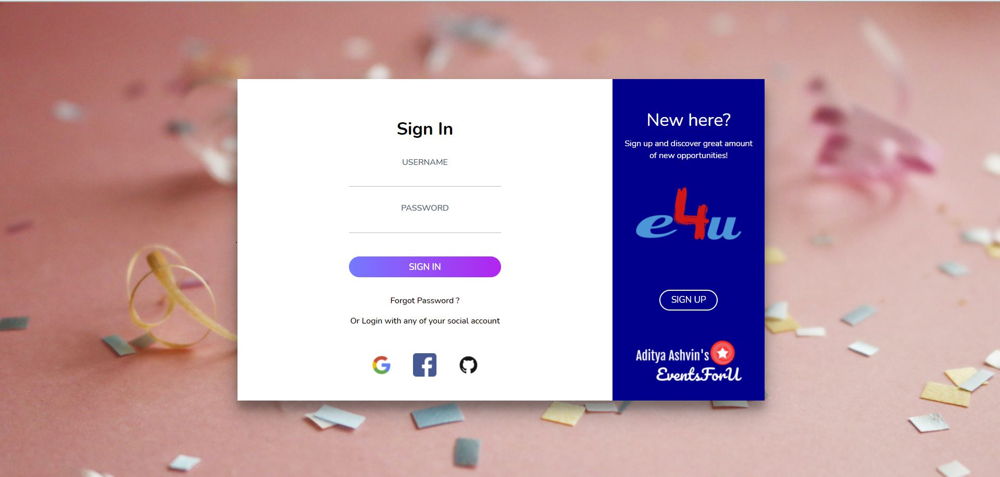
### SignUp Page
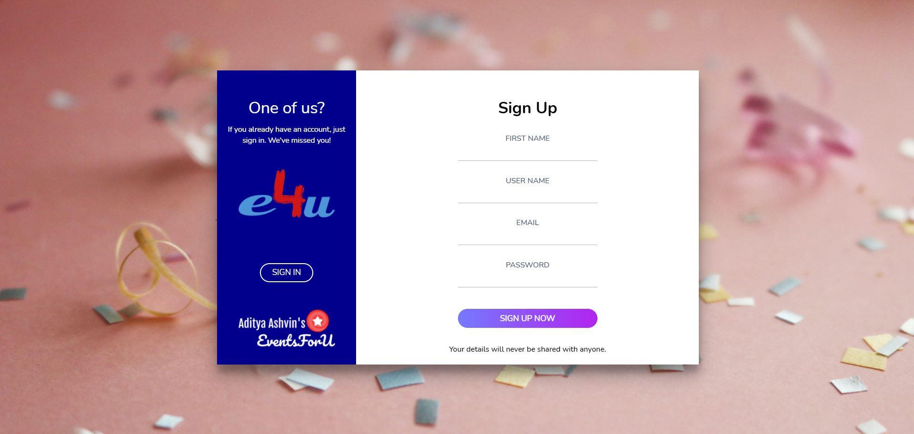
### v0.3
### Tags, Location added

### Search Bar
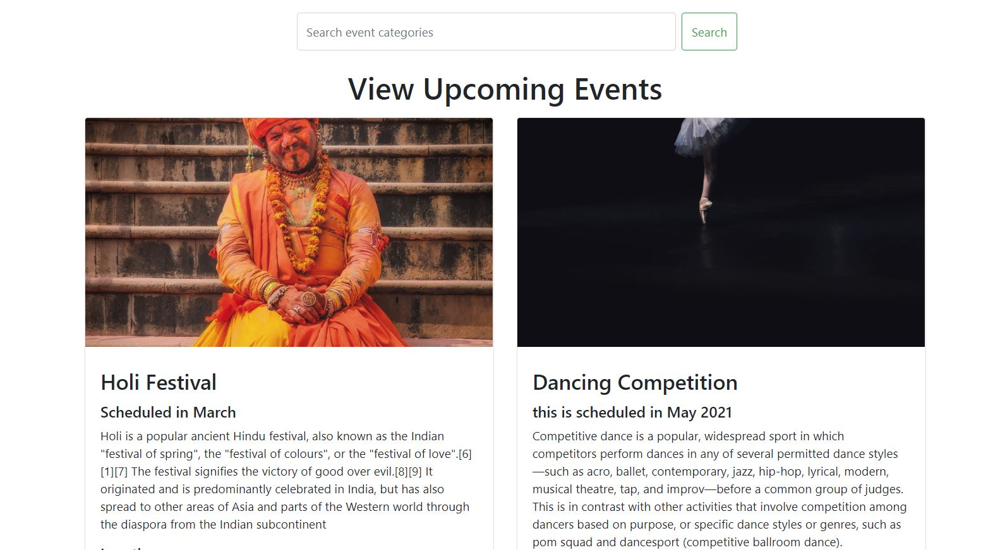
### reCAPTCHA

### Registration Completed email
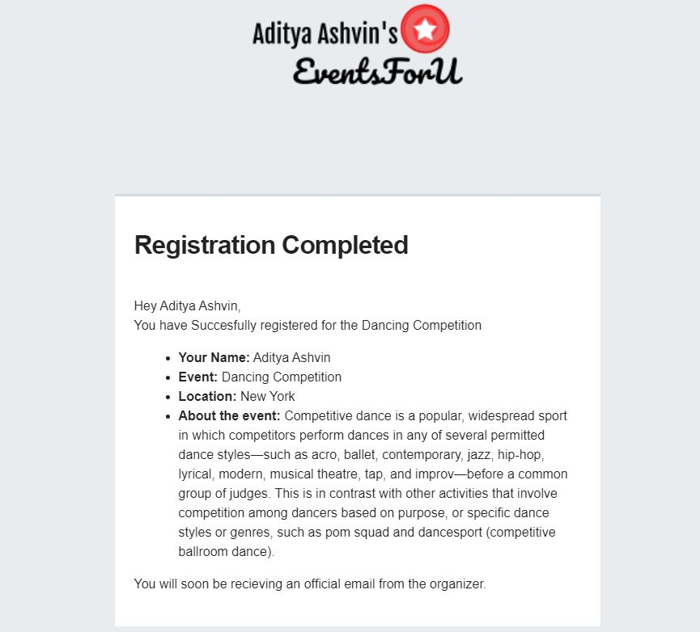

### This UI of the website is built with the help of
> [Bootstrap](https://getbootstrap.com/)
>
> [FontAwesome](http://fontawesome.io/)
>
> [Unsplash API](https://unsplash.com/developers)
### Logo made using
> [LogoMaker](https://www.freelogodesign.org/)
